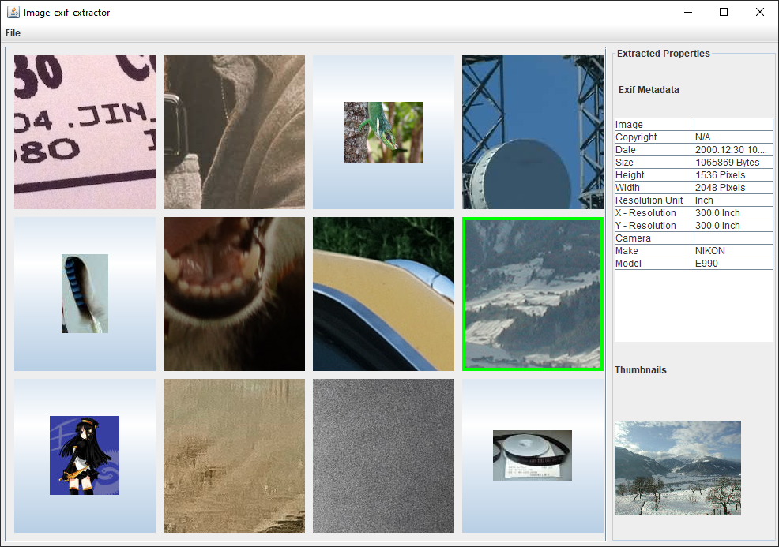

# Image Exif Processor

This small project demonstrates the usage [metadata-extractor](https://github.com/drewnoakes/metadata-extractor) of the library to extract EXIF metadata from an image.
The purpose of this demo is to grab the following informations from picture:
-   ImageWidth
-   ImageLength
-   XResolution
-   YResolution
-   ResolutionUnit
-   DateTime
-   Make
-   Model
-   Copyright

## How to run the project.

Clone the repository and open it with any Java IDE with gradle support.

Launch the project and follow the **File -> Open** menu to open a folder containing pictures. You can then click on any picture to display its metadata if available.

## Known Issues and expected improvements.

-   Increase code coverage: Only the **extractExif** method has been tested with Junit.
-   Main UI progress bar resizing.